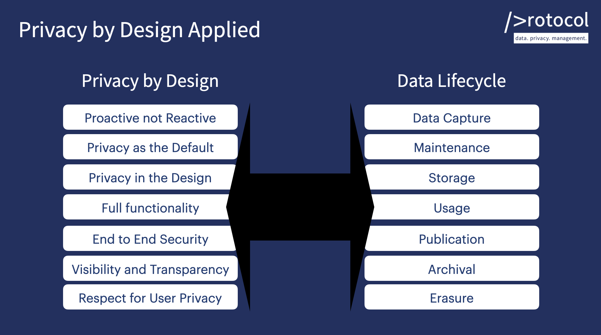

# Data Protocol Lean Compliance



## Introduction

Data compliance is a priority for all code being written that uses personal identifying data that could infringe on privacy. Data Protocol is the world's leading commmunity focusing on the needs of the developer community with respect to data management and privacy. Lean Compliance &copy; integrates the lean approach into how developers already work with git, version control and lean development processes.

The process assume knowledge of Privacy by Design and asssociated required best practices.

To learn this please visit [Data Protocol](https://dataprotocol.com) and take the associated online [courses](https://dataprotocol.com/courses/new-privacy-by-design/).

## Setup

Install [node.js](https://nodejs.org/) development environment (node and npm) if not already installed.

The Lean Compliance REPO is designed to be embedded as a subtree within another existing/surrounding repo, the one that is being managed from a compliance perspective. For more background on git subtree please read [here](https://blog.developer.atlassian.com/the-power-of-git-subtree/?_ga=2-71978451-1385799339-1568044055-1068396449-1567112770) and [here](https://stackoverflow.com/questions/36720318/git-how-to-use-git-subtree-with-existing-git-sub-repo).

Open a terminal window and change directory to the root of the repo you wish to embed lean compliance within.

Install and initialize lean-compliance using the below commands.

```/bin/sh
git subtree add --prefix lean-compliance https://github.com/Data-Protocol/lean-compliance.git master --squash
git submodule init
git submodule update
cd lean-compliance
npm install
```

To run any of the below commands (ex. generate, report) navigate to the lean-compliance directory and execute the wanted command.

```/bin/sh
npm run generate
npm run report
npm run p2paudit
```

Open your favorite SDE. For example, with VSCode.

```/bin/sh
code .
```

It is a simple as that. You are now completely ready to start.

## How to apply Lean Compliance to your Project

At the highest level, the application of lean compliance follows the below workflow.

1. Complete the [Privacy by Design workbook json file](./DATA/PBD-workbook.json) in the [DATA](./DATA) directory.
1. Update/Complete the [data-objects.json](./DATA/data-objects.json) file in the [DATA](./DATA) directory
1. Run the command `npm run generate` to generate additional files that need completion, based on the identified data objects and associated data object types added to [data-objects.json](./DATA/data-objects.json).
1. Once all files are updated to a wanted level run the command `npm run report` to generate the current COMPLIANCE REPORT which is stored as the [README.md](./COMPLIANCE/README.md) file in the [COMPLIANCE](./COMPLIANCE) directory.
1. **OPTIONAL** - After generating a COMPLIANCE report that you feel comfortable with you can request an independent peer-to-peer audit via Data Protocol by issuing the command `npm run p2paudit`.

NOTE: All commands should be executed from within the lean-compliance sub-directory.

### New Projects

For new projects, consider these aspects before starting coding and ensure they are updated as the code evolves.

### Existing Projects

For existing projects, consider what data is already being used and stored, understand the reason why and complete the [data-objects.json](./DATA/data-objects.json) file to create the existing code baseline. As the code and data usage further evolves, document and consider proactively.

## More Details

There are three main directories to be aware of.

1. **DATA** - The [DATA](./DATA) directory is where most of the compliance questions require answering. Each data object listed in the [data-objects.json](./DATA/data-objects.json) file will have one or more json templates that will require completion. For certain object types, overall documents might require completion. For example, the [generic data object](./templates/generic-data-object.json) type adds an overall [generic-contacts.json](./templates/generic-contacts.json) file where the external names and means of contact need to be completed.

1. **COMPLIANCE** - The [COMPLIANCE](./COMPLIANCE) directory is where the final compliance documents are generated and reside.
1. **templates** - For most users, the [templates](./templates) directory does not need to be understood. The templates is where the base templates are kept for different object types and needed checklists. The contained README.md explains how you can create PULL request to create new data object types and templates and suggest changes/additions to existing data object templates.
